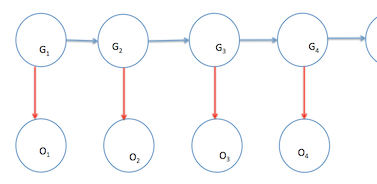

3. An HMM to infer recombination events
-----------------------------
#### Defining the problem we want to solve
We want to identify recombination events in the progeny of a biparental cross for which
we have phased and genotyped parents and non-phased, genotyped progeny.

In the terms of our simulated chromatids, we have the parental and maternal genotypes
for each of both child chromatids of a diploid individual in the progeny. We also have
the combined genotype of both chromatids in the individual of the progeny but not its 
phasing.

What we want is to recognize parental segments (out of 4 parental chromatides) that 
contributed to the final genotype in the individual of the progeny, that is the
parent.path for each of the chromatids in the the child.

```{r eval=TRUE, echo=FALSE}

source("SharedFunctions.R")


```

Using our chromatid simulator:

```{r}

child1.chromatid.mom<-SimulateChromatid()
child1.chromatid.dad<-SimulateChromatid()
child1.chromatid.mom["child"]
child1.chromatid.dad["child"]
```
Then our diploid "child" genotype would be. (Remember, 0 for homozygous reference,
1 for heterozygous and 2 for homozygous alternate allele).
```{r}
child1.genotype<-child1.chromatid.mom$child+child1.chromatid.dad$child
child1.genotype
```
And we still have acces to the phased parent genotype.
```{r}
child1.chromatid.mom$maternal
child1.chromatid.mom$paternal
child1.chromatid.dad$maternal
child1.chromatid.dad$paternal
```
Now using the diploid child genotype and parental phased chromatid genotypes
we can infer the parent.path with a Hidden Markov Model (HMM), and compare our inference
to the actual parent.paths we have stored from the simulation. 
```{r}
child1.chromatid.mom$parent.path
child1.chromatid.dad$parent.path
````
 
#### Defining our HMM


According to the diagram, our observed states O~i~ are dependent on our hidden states G~i~.
Each hidden state G~i+1~ is dependent on the previous G~i~ state.

Our observations fo the child genotype, O~1~, O~2~, ..., O~n~ 
will be one of three possible values or states:

  *0*, *1* or *2*.

Our hidden states G~1~, G~2~, ..., G~n~ will be one of four possible sates:

*mom.maternal/dad.maternal, mom.maternal/dad.paternal, mom.paternal/dad.maternal, mom.paternal/dad.paternal *

Having the observed and hidden states of our model defined now we need to define the
transition and emission probability matrix.

#### Further defining our HMM, transition and emission probability matrixes
The transition probability matrix has the probabilities of getting certain state in G~i+1~ given
the state of hidden state G~i~.

This will be our transition probability matrix, with r being the recombination rate.


x               |mom.maternal/dad.maternal|mom.maternal/dad.paternal|mom.paternal/dad.maternal|mom.paternal/dad.paternal|
---------------:|:----------:|:----------:|:----------:|:----------:|
**mom.maternal/dad.maternal**| (1-r)(1-r)  |(1-r)r     |(1-r)r       |r*r         |
**mom.maternal/dad.paternal**| (1-r)r        |(1-r)(1-r)         | r*r       |(1-r)r         | 
**mom.paternal/dad.maternal**|(1-r)r         |r*r        | (1-r)(1-r)         |(1-r)r         |
**mom.paternal/dad.paternal**|r*r         |(1-r)r       | (1-r)r       |(1-r)(1-r)          |

It woud be good to have a function to create this transition matrix given a recombination rate.
```{r}
GetTransitionProb<-function(r){
  # r is the recombination rate
  transition.matrix<-matrix(rep(r*(1-r),16),ncol=4);
  transition.matrix[1,1]=(1-r)^2;
  transition.matrix[2,2]=(1-r)^2;
  transition.matrix[3,3]=(1-r)^2;
  transition.matrix[4,4]=(1-r)^2;
  transition.matrix[4,1]=r^2;
  transition.matrix[3,2]=r^2;
  transition.matrix[2,3]=r^2;
  transition.matrix[1,4]=r^2;
  rownames(transition.matrix)<-c('mom.maternal/dad.maternal','mom.maternal/dad.paternal',
                                 'mom.paternal/dad.maternal','mom.paternal/dad.paternal')
  colnames(transition.matrix)<-rownames(transition.matrix)      
  return(transition.matrix)
}

GetTransitionProb(0.2)
```

The emission probability matrix has the probabilities of observing O~i~ given 
a G~i~

Because we have the genotype and phase of the parents we can use that information
in our emission matrix. Depending on the genotypes of the parents we will have different
emmission matrixes.

At each locus we have 16 possible genotypes from the parents, the 4 parental chromatids 
can have 2 possible genotypes, reference or alternate (0 or 1), 2^4^=16. 

x               |genotype_0|genotype_1|genotype_2|...         |genotype_15
---------------:|:--------:|:--------:|:--------:|:----------:|:----------:|
**mom.maternal**| 0        |0         |0         |            |1
**mom.paternal**| 0        |0         | 0        |            | 1
**dad.maternal**| 0        |0         | 1        |            |1
**dad.paternal**|0         |1         | 0        |            |1


The emission probability matrix for genotype_2 would look like this:


x                            |0           |       1     |2|
----------------------------|:----------:|:----------:|:----------:|
**mom.maternal/dad.maternal**|0           | 1          |0           |
**mom.maternal/dad.paternal**|1           |   0        | 0          |
**mom.paternal/dad.maternal**|0           |1           | 0          |
**mom.paternal/dad.paternal**|1           |0           | 0          |

and for  genotype_15 would look like this:

x                            |0           |       1    |2           |
-----------------------------|:----------:|:----------:|:----------:|
**mom.maternal/dad.maternal**|0           | 0          |1           |
**mom.maternal/dad.paternal**|0           |   0        | 1          |
**mom.paternal/dad.maternal**|0           |0           | 1          |
**mom.paternal/dad.paternal**|0           |0           | 1          |


Now, we can make a function to generate those matrixes given a set of maternal
and paternal genotypes.

```{r}
GetEmissionProb<-function(mom.maternal,mom.paternal,dad.maternal,dad.paternal){
  row.1<-c(as.numeric(mom.maternal+dad.maternal==0),
           as.numeric(mom.maternal+dad.maternal==1),
           as.numeric(mom.maternal+dad.maternal==2))
  row.2<-c(as.numeric(mom.maternal+dad.paternal==0),
           as.numeric(mom.maternal+dad.paternal==1),
           as.numeric(mom.maternal+dad.paternal==2)) 
  row.3<-c(as.numeric(mom.paternal+dad.maternal==0),
           as.numeric(mom.paternal+dad.maternal==1),
           as.numeric(mom.paternal+dad.maternal==2))
  row.4<-c(as.numeric(mom.paternal+dad.paternal==0),
           as.numeric(mom.paternal+dad.paternal==1),
           as.numeric(mom.paternal+dad.paternal==2))      
  
  emission.matrix<-rbind(row.1,row.2,row.3,row.4)
  colnames(emission.matrix)<-c('0','1','2')
  rownames(emission.matrix)<-c('mom.maternal/dad.maternal','mom.maternal/dad.paternal',
                               'mom.paternal/dad.maternal','mom.paternal/dad.paternal')
  
  return(emission.matrix)
}

```

Now we can test it with the alleles from genotype_0, genotype_2, and genotype_15
```{r}
GetEmissionProb(0,0,0,0) #genotype_0
GetEmissionProb(0,0,1,0) #genotype_2
GetEmissionProb(1,1,1,1) #genotype_15
```


#### Author
Luis Avila (lmavila@gmail.com)